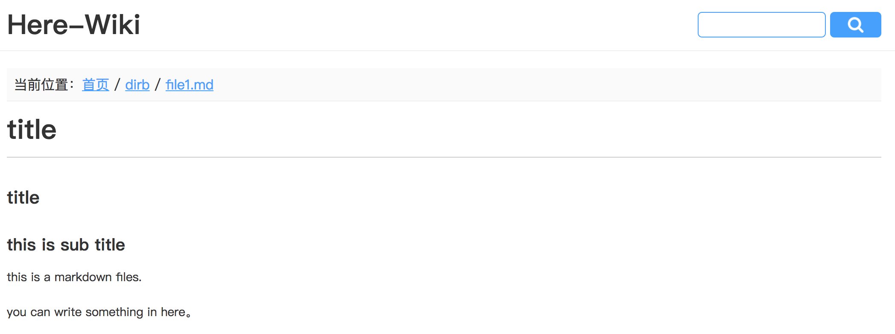

# wiki
a wiki system

## feature
 
* **watch folder**, auto scan the actions: addfile,adddir,changefile,deletefile,delete dir
* **easy read**, easy to read, easy to index,easy to search



## how to debug
debug this app need to install yog2 and fis
```
npm i fis -g
npm i yog2 -g
```
1. fork my git,download to local
2. modify file 'base/app.js' line 16, confirm a free port 
3. modify markdown root dir '/base/conf/plugins/filescan.js'
4. modify mysql conf '/base/conf/plugins/knex.js'
5. import the db structure(wiki.mysql) to your mysql
6. start runtime:
```
cd base
npm i	## first time，install the dependencies
yog2 run
```
7. deploy service code:
```
cd home
npm run dev
```
8. preview wiki，for example: [http://127.0.0.1:8081](http://127.0.0.1:8081)

